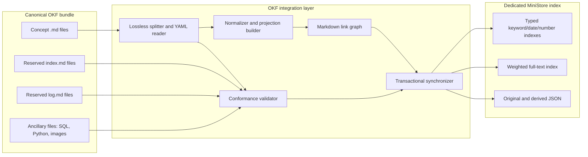
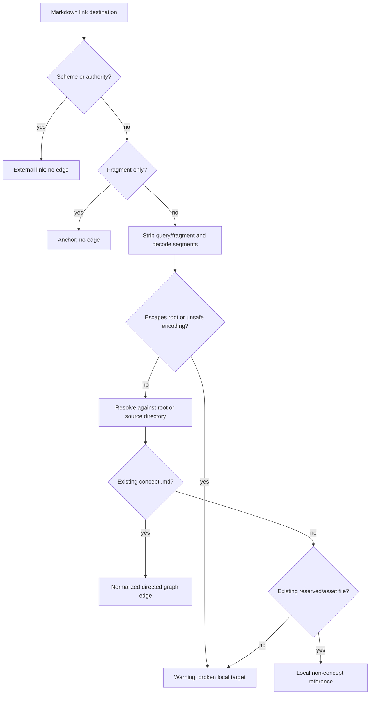

# Open Knowledge Format v0.2 support for MiniStore

## Executive summary

MiniStore will support the Open Knowledge Format (OKF) v0.2 as a conformant,
lossless consumer and searchable projection. An OKF bundle remains the source of
truth: a UTF-8 directory tree of Markdown files with YAML frontmatter. MiniStore
parses and validates that tree, derives a flat document representation suited to
its existing schema and query model, and synchronizes the projection into one
index transactionally.

The same externally observable behavior will be implemented in both repositories:

- `ministore`, written in Go, supporting its SQLite and PostgreSQL adapters; and
- `ministore-rust`, written in Rust, supporting SQLite.

The implementations will not share runtime code. They will share the format
contract, JSON output contracts, and versioned conformance fixtures described in
this document. Given the same bundle, date, and options, both implementations must
produce equivalent validation findings and equivalent indexed JSON documents.

The key design decisions are:

1. **The bundle is canonical; the index is disposable.** Editing the index never
   edits the bundle. Rebuilding the index from the bundle must always be safe.
2. **One OKF bundle maps to one MiniStore index.** This avoids ambiguous paths,
   destructive cross-bundle synchronization, and a premature multi-tenant model.
3. **Parsing and validation are independent of MiniStore.** They are public
   library capabilities and can run without creating or opening an index.
4. **The importer derives flat fields from nested OKF metadata.** It never expects
   `generated`, `verified`, `sources`, or attestation metadata to fit directly into
   MiniStore's flat schema.
5. **Original concept documents are preserved verbatim.** The indexed JSON stores
   the exact UTF-8 document and exact YAML frontmatter text. No exporter needs to
   reconstruct YAML from JSON.
6. **Only concept documents become MiniStore items.** Reserved files and ancillary
   assets remain in the canonical bundle. MiniStore is a search index, not a
   general-purpose bundle archive.
7. **Synchronization stages the complete projection before writing.** It computes
   graph-derived fields such as backlinks against a complete snapshot, skips
   unchanged projections by hash, and applies additions, updates, and deletions in
   one database transaction.
8. **Errors and guidance are different.** Base-conformance violations are errors.
   Broken links and malformed optional families are warnings because OKF requires
   consumers to remain permissive.

This design targets the upstream `SPEC.md` identified by:

- OKF version: `0.2`
- upstream repository commit: `3fcbb9f828c2f23d109c855ee403c3a4c81f3a96`
- specification SHA-256:
  `5a3311d270bebb16d558010e75064f5b75323f284992641732b1c8097511f948`

Pinning the reviewed text matters because OKF is actively evolving. Open upstream
discussions cover typed relationships, deletion semantics, bundle metadata,
percent-encoded paths, and concept-ID character rules. Unknown fields and newer
minor versions must therefore survive ingestion even when MiniStore does not index
their semantics.

## Problem and desired outcome

OKF stores structured and unstructured knowledge together. Its structured metadata
supports type filtering, provenance, trust, lifecycle, and attested computations.
Its Markdown body provides human- and model-readable context. Standard Markdown
links form a directed knowledge graph. A useful MiniStore integration must expose
all three dimensions without turning the index into a competing source of truth.

MiniStore already has most of the required storage primitives: unique document
paths, JSON retention, weighted full-text fields, multi-valued keywords and dates,
transactional batches, and structured filtering. The mismatch is structural. OKF
is a directory and graph with nested, extensible YAML metadata; MiniStore indexes a
flat, declared JSON schema. A direct YAML-to-JSON import either loses formatting and
unknown YAML forms or rejects valid metadata that does not match the declared index
schema.

The feature is successful when a user can:

- validate an OKF v0.2 bundle and receive stable, actionable diagnostics;
- create a dedicated MiniStore index from a conformant bundle;
- search concepts by text, type, tags, lifecycle, trust, provenance, dates,
  runtime, and graph relationships;
- synchronize additions, edits, moves, and removals without leaving partial or
  stale index state;
- retrieve the original concept document byte-for-byte from an indexed concept;
- use the same CLI concepts and receive equivalent results in Go and Rust; and
- rebuild the index without depending on a previous manifest or index state.

## Scope and terminology

### In scope

- OKF v0.2 concept parsing, including arbitrary additional frontmatter keys.
- Base-conformance and advisory validation from specification sections 4–13.
- Reserved `index.md` and `log.md` structural validation.
- v0.1 `timestamp` and `# Citations` read fallbacks described in OKF v0.2.
- Projection of recognized metadata into a fixed MiniStore schema.
- CommonMark link parsing, local target resolution, forward links, and backlinks.
- Validation of Attested Computation contract shape.
- Deterministic full-bundle synchronization with transactional database writes.
- Go SQLite, Go PostgreSQL, and Rust SQLite behavior parity.
- Public Go and Rust library APIs plus CLI commands.
- Stable machine-readable validation and synchronization reports.

### Explicitly out of scope

- Editing OKF documents through MiniStore.
- Executing computations, executors, or attesters.
- Fetching external URLs or checking whether external resources are live.
- Treating trust tiers as authorization or access control.
- Archiving every ancillary file in the database.
- Reconstructing an entire bundle from the database alone.
- Automatically generating or rewriting `index.md` or `log.md`.
- Watching a directory continuously. `sync` is an explicit point-in-time command.
- Multiple bundles in one index or queries across multiple indexes.
- Inventing typed relationship semantics not present in the pinned v0.2 spec.
- In-place migration of a generic MiniStore index into an OKF index.

An **OKF concept document** is any `.md` file except the reserved names `index.md`
and `log.md`. Its **concept ID** is its bundle-relative path without `.md`. An
**OKF projection** is the flat JSON document derived from one concept and stored as
one MiniStore item. The **source hash** covers the original file bytes. The
**projection hash** covers every field whose change must update the index, including
graph-derived fields.

## Architectural boundary

The bundle and the index have intentionally different responsibilities.



Only concept documents cross the final boundary into MiniStore items. Reserved
files participate in validation and graph/path resolution but are not searchable
concepts. Ancillary files can satisfy local path references and are checked for
existence when appropriate, but their bytes are not copied into `data_json`.

This boundary resolves an apparent conflict in “lossless support.” MiniStore can
return every indexed concept exactly as imported because the raw concept is stored.
It does not claim to be a byte-for-byte archive of the entire bundle. OKF itself
does not require a consumer to archive a bundle or provide export functionality.

## Why the obvious direct-import design is insufficient

The obvious implementation is to split frontmatter, deserialize YAML into a map,
add `path` and `body`, serialize the map to JSON, and call `PutJSON`. That design is
small, but it fails in several important ways:

- Nested metadata is not indexable because MiniStore only examines declared
  top-level fields.
- Mapping all unknown keys to top-level JSON can collide with derived fields and
  cause valid extension values to fail schema validation.
- YAML-to-JSON conversion loses comments, ordering, scalar spelling, anchors, and
  formatting, so export cannot be lossless.
- A single `verified` mapping and a list of verification mappings are both valid
  OKF representations and require normalization before derivation.
- A regular expression does not implement Markdown links. It misreads code fences,
  reference links, escaped destinations, titles, entities, and percent-encoding.
- Backlinks depend on the complete set of parsed concepts, not the current file.
- Updating only files whose source bytes changed misses backlinks affected by a
  different file being added, removed, or edited.
- Upserting every document on every run changes MiniStore recency and rebuilds FTS
  rows even when the logical projection is unchanged.

The proposed parse–normalize–resolve–project pipeline is only slightly larger, but
it establishes explicit contracts at each failure-prone boundary.

## Component model

### Go package layout

The Go repository will add a public `okf` package. OKF is a portable format, so
parsing and validation belong outside `cmd/` and must be usable by applications
embedding MiniStore.

```text
okf/
  document.go       byte-preserving frontmatter/body splitting
  yaml.go           YAML-node access and recognized-field decoding
  model.go          documents, events, sources, reports, and options
  validate.go       bundle and document validation
  reserved.go       index.md and log.md validation
  links.go          Markdown AST extraction and target resolution
  projection.go     normalized OKF concept -> MiniStore JSON
  schema.go         canonical OKF index schema and projection version
  sync.go           staging, comparison, batch update, and reports
  errors.go         stable error and finding codes
  testdata/         versioned conformance fixtures

cmd/ministore/
  main.go           adds the okf command group dispatch
  okf.go            OKF CLI parsing and rendering
```

The existing CLI is monolithic. Adding `okf.go` isolates the new command group
without making a broad CLI refactor part of this feature.

The Go implementation will add `gopkg.in/yaml.v3` and a Markdown parser with an
AST API, preferably `github.com/yuin/goldmark`. YAML nodes are used instead of
direct deserialization so recognized scalars can be interpreted consistently with
Rust while the original YAML remains untouched.

### Rust crate layout

The Rust repository will add a separate workspace crate so the core `ministore`
crate does not acquire Markdown and YAML dependencies for users who do not need
OKF.

```text
crates/ministore-okf/
  Cargo.toml
  src/
    lib.rs
    document.rs
    yaml.rs
    model.rs
    validate.rs
    reserved.rs
    links.rs
    projection.rs
    schema.rs
    sync.rs
    error.rs
  testdata/

crates/ministore-cli/src/
  main.rs            adds Okf to the top-level enum
  commands/okf.rs    OKF CLI arguments and dispatch
```

The crate will use `yaml-rust2` directly for YAML nodes and `pulldown-cmark` for
Markdown events. The `gray_matter` crate is not selected: its historical issues
include leading/trailing whitespace removal and removal of meaningful Markdown
trailing spaces, and its API is optimized for parsed content rather than exact
source preservation. Both implementations therefore use a small, explicitly
specified delimiter splitter and delegate only YAML parsing to a library.

### Minimal MiniStore core addition

Synchronization must enumerate the paths currently in the dedicated index to
delete concepts removed or renamed in the bundle. Neither implementation exposes
an efficient path-listing API. Both cores will add the same narrow operation:

Go:

```go
func (ix *Index) ListPaths(ctx context.Context, prefix string) ([]string, error)
```

Rust:

```rust
pub fn list_paths(&self, prefix: &str) -> Result<Vec<String>>
```

The methods return paths in ascending bytewise order. An empty prefix lists every
item. A non-empty prefix performs a literal prefix match; it is not a query glob.
The implementation uses a parameterized `WHERE path LIKE escaped_prefix || '%'`
or the backend-equivalent range predicate. It must escape `%`, `_`, and the escape
character. This API is useful beyond OKF, exposes no storage internals, and avoids
using the user query language as an administrative scan API.

No OKF-specific tables or columns are added to MiniStore.

## Parsing and preservation contract

### Input enumeration

The bundle loader walks the supplied root recursively and sorts every
bundle-relative path by UTF-8 byte sequence before processing. It does not follow
symbolic links. A symlink encountered anywhere under the root produces a warning
and is ignored. This prevents traversal outside the declared bundle and makes
behavior independent of host symlink policies.

The loader classifies paths as:

- `concept`: `.md`, basename other than `index.md` or `log.md`;
- `index`: basename exactly `index.md`;
- `log`: basename exactly `log.md`;
- `ancillary`: every other regular file; or
- `ignored`: directories, symlinks, sockets, devices, and other special files.

Filename matching is case-sensitive because OKF paths are case-sensitive logical
identifiers even on a case-insensitive host. The validator reports a portability
warning when two relative paths differ only by Unicode case folding.

### UTF-8 and delimiter splitting

Concept documents must be valid UTF-8. The parser retains the original bytes and
also exposes string slices for frontmatter and body. It accepts `LF` and `CRLF`
without normalizing either in the retained source.

The delimiter algorithm is deliberately small:

1. Optionally recognize a UTF-8 BOM. Preserve it and emit `OKF010` as a warning.
2. Read the first physical line. After removing only its line ending, it must be
   exactly `---`. Leading or trailing spaces are accepted for compatibility only
   when `LenientDelimiters` is enabled; they produce `OKF011`.
3. Scan subsequent physical lines until a line whose content, excluding its line
   ending, is exactly `---`.
4. The bytes between delimiters are `frontmatter_yaml`. The bytes after the closing
   delimiter and its line ending are `body`. Blank lines are not added or removed.
5. A missing closing delimiter is a parse error. A `---` line in the body has no
   special meaning because scanning stops at the first closing delimiter.

`index.md` and `log.md` are initially treated as Markdown. A root `index.md` may
use the same splitter for its permitted `okf_version` frontmatter.

### YAML behavior

The frontmatter must parse as one YAML mapping. Known OKF keys are read by exact
string key. Unknown keys and values cannot cause rejection unless they make the
YAML itself unparseable. Duplicate top-level keys are warnings because parsers
otherwise disagree about first-key versus last-key behavior. The first occurrence
is used for recognized-field projection, preventing a later duplicate from
silently changing indexed behavior.

Recognized scalar extraction follows these rules:

- String fields accept YAML string scalars only, except date fields also accept a
  YAML timestamp scalar and use its original lexical value.
- `tags` accepts a sequence of scalar strings. A scalar tag is tolerated as a
  one-element list with a warning because real upstream bundles have contained
  this shape; strict mode rejects the warning, not the document by default.
- `verified` accepts a mapping or sequence. A mapping normalizes to a one-element
  sequence as required by OKF v0.2 section 5.2.
- `sources` must be a sequence for advisory validity. A mapping is tolerated as a
  one-element sequence with a warning for defensive consumption.
- YAML aliases may be resolved for known fields, subject to the resource limits
  below. Raw source remains authoritative.
- Unknown YAML values are never flattened into MiniStore fields.

The indexed document stores both `raw_document` and `frontmatter_yaml` as
undeclared JSON fields. MiniStore already retains undeclared fields in `data_json`
while skipping them during typed indexing. This preserves arbitrary extensions
without letting their types break the index schema.

### Resource limits

Parsing untrusted YAML and Markdown must be bounded. Defaults are:

| Limit | Default | Behavior when exceeded |
|---|---:|---|
| Concept or reserved Markdown file | 8 MiB | error for that file |
| Total regular files encountered | 100,000 | operational error |
| Total bytes read in one bundle | 1 GiB | operational error |
| YAML nesting depth | 64 | parse error |
| YAML nodes per document | 100,000 | parse error |
| Markdown links per document | 100,000 | warning and truncate graph extraction |

Library callers can lower or raise these limits through `LoadOptions`. The CLI
offers `--max-file-size` and `--max-bundle-size`; the structural limits remain
library options to avoid an oversized CLI surface.

## Conformance and advisory validation

### Finding model

Validation returns all findings that can be determined safely; it does not stop at
the first bad document.

```json
{
  "ok": true,
  "target_version": "0.2",
  "bundle": "/absolute/path/to/bundle",
  "counts": {"concepts": 12, "errors": 0, "warnings": 2},
  "findings": [
    {
      "severity": "warning",
      "code": "OKF241",
      "path": "tables/orders.md",
      "line": 14,
      "column": 3,
      "spec_section": "6.1",
      "message": "link target '../missing.md' does not exist in the bundle"
    }
  ]
}
```

Fields are stable. `line` and `column` are one-based and omitted when unavailable.
Findings are sorted by path, line, column, severity, and code. Human-readable text
may improve without a compatibility promise; codes and JSON field meanings are
versioned API.

### Errors

Errors correspond to the base-conformance rules in OKF v0.2 section 11 and the
reserved-file structures it incorporates:

| Code family | Condition |
|---|---|
| `OKF1xx` | concept input/frontmatter is oversized, invalid UTF-8, missing, unterminated, invalid YAML, not a mapping, or has a missing/non-string/empty `type` |
| `OKF2xx` | a non-root `index.md` has frontmatter, an index entry violates the section/list/link structure, or a `log.md` date heading is not `YYYY-MM-DD` |

Unknown types, unknown keys, absent optional families, broken links, and missing
`index.md` files are never errors.

### Warnings

Warnings cover soft guidance and data that cannot be indexed with full semantics:

- malformed `sources`, `generated`, `verified`, `status`, `stale_after`,
  `usage_window`, `executor`, `attester`, or `parameters` shapes;
- `sources` entries without `resource`;
- duplicate `sources[].id` values or body footnote labels without a matching ID;
- malformed actor strings, without rejecting unknown producer conventions;
- `generated.at` or `verified[].at` values that are not ISO 8601;
- legacy v0.1 `timestamp` or `# Citations` use;
- incomplete Attested Computation contracts, including missing `runtime`, both or
  neither computation forms, malformed parameters, or malformed receipt fields;
- broken local links, bundle-root escapes, case-fold path collisions, ignored
  symlinks, and malformed percent escapes;
- an unsupported declared `okf_version`; and
- recognized fields with tolerated scalar/list coercions.

Attested Computation incompleteness is a warning, not a base-conformance error.
Section 10 calls `runtime` required for that type, but section 11 defines base
bundle conformance narrowly and tells consumers to treat the other constraints as
soft guidance. `--strict` converts any warning into a failing command without
changing its severity in the report.

### Stable finding-code catalog

The first implementation must use the following codes. A validator may emit more
than one code for one file when the findings are independently actionable. It must
avoid cascades: for example, invalid YAML suppresses recognized-family checks
because their input is unavailable.

| Code | Default severity | Meaning |
|---|---|---|
| `OKF100` | error | Markdown concept is not valid UTF-8 |
| `OKF101` | error | concept has no opening frontmatter delimiter |
| `OKF102` | error | concept has no closing frontmatter delimiter |
| `OKF103` | error | frontmatter is not parseable YAML |
| `OKF104` | error | frontmatter root is not a mapping |
| `OKF105` | error | `type` is absent, not a string, or empty after trimming |
| `OKF106` | warning | recognized top-level key occurs more than once |
| `OKF107` | warning | document begins with a UTF-8 BOM |
| `OKF108` | warning | frontmatter delimiter contains tolerated whitespace |
| `OKF109` | error | individual Markdown file exceeds the configured size limit |
| `OKF200` | error | non-root `index.md` contains frontmatter |
| `OKF201` | error | `index.md` does not contain the required section structure |
| `OKF202` | error | `index.md` list entry is not link-first |
| `OKF203` | error | `log.md` level-two date heading is not `YYYY-MM-DD` |
| `OKF204` | warning | two bundle paths collide under Unicode case folding |
| `OKF205` | warning | symlink or special file is ignored |
| `OKF206` | warning | root `okf_version` is syntactically invalid |
| `OKF207` | warning | declared OKF version is not implemented exactly |
| `OKF300` | warning | `sources` has a malformed container or entry |
| `OKF301` | warning | a `sources` entry has no non-empty `resource` |
| `OKF302` | warning | non-empty `sources[].id` is duplicated |
| `OKF303` | warning | shared or per-source `usage_window` is malformed |
| `OKF304` | warning | source credibility signal has the wrong type or format |
| `OKF310` | warning | `generated` is not a mapping or lacks non-empty `by` |
| `OKF311` | warning | `generated.at` is not an ISO 8601 datetime |
| `OKF312` | warning | `verified` is neither a mapping nor a valid sequence of mappings |
| `OKF313` | warning | verification event lacks valid `by` or ISO 8601 `at` |
| `OKF314` | warning | recognized actor field does not follow the actor convention |
| `OKF315` | warning | latest verification predates the current `generated.at` |
| `OKF320` | warning | `status` is not `draft`, `stable`, or `deprecated` |
| `OKF321` | warning | `stale_after` is not an ISO `YYYY-MM-DD` date |
| `OKF330` | warning | tags required scalar-to-list coercion or contain non-string values |
| `OKF340` | warning | legacy v0.1 `timestamp` fallback is present |
| `OKF341` | warning | legacy v0.1 `# Citations` section is present |
| `OKF350` | warning | Attested Computation lacks a non-empty `runtime` |
| `OKF351` | warning | Attested Computation parameters are malformed |
| `OKF352` | warning | computation is supplied by both forms or by neither form |
| `OKF353` | warning | executor mapping, resource, or receipt declaration is malformed |
| `OKF354` | warning | attester mapping or resource is malformed |
| `OKF360` | warning | body footnote label has no matching `sources[].id` |
| `OKF400` | warning | local Markdown target does not exist as a concept |
| `OKF401` | warning | local path escapes the bundle root |
| `OKF402` | warning | local destination contains malformed or unsafe percent encoding |
| `OKF403` | warning | per-document link limit was reached and extraction was truncated |

Resource-limit exhaustion that prevents a complete report is an operational error,
not a finding. File-specific size overflow is `OKF109`; the validator may continue
only when it can still prove that total resource bounds are respected. Any future
code must be additive; existing codes never change meaning.

### Version behavior

The root `index.md` may declare `okf_version`. No declaration means the caller's
target version, defaulting to `0.2`.

- Declared `0.2`: validate and project normally.
- Undeclared: validate as `0.2` and record `declared_version: null`.
- Newer unknown version: emit a warning and make a best-effort projection of known
  fields. Do not reject unknown types or keys.
- Syntactically invalid version: emit a warning and use the target version.

The implementation never silently applies proposed upstream issue semantics, such
as typed relationship retrieval policy or trust invalidation after regeneration.
Those require a new reviewed projection version.

## Markdown links and graph construction

Links are parsed using a Markdown AST or event stream, not regular expressions.
Both inline and reference-style links are supported. Images and links inside code
spans or fenced code blocks are excluded. Footnote references are handled
separately for source attribution.

### Resolution algorithm

For every Markdown link destination:

1. Parse the destination as a URI reference.
2. If it has a scheme or authority, classify it as external and do not create a
   graph edge.
3. If it contains only a fragment, classify it as an intra-document anchor and do
   not create a graph edge.
4. Remove the query and fragment for local file resolution.
5. Percent-decode path segments exactly once. Encoded `/`, `\`, NUL, and malformed
   escapes produce a warning and are not treated as separators.
6. Resolve a leading `/` from the bundle root. Resolve any other path from the
   source document's directory.
7. Normalize `.` and `..`. A path escaping the bundle root is a broken local link
   warning.
8. If the normalized path names an existing non-reserved `.md` document, convert
   it to a concept ID and record an edge.
9. If it names a missing `.md` path, record it in `broken_link_targets` and warn.
10. If it names a reserved or ancillary file, treat it as a non-concept local
    reference. It may satisfy path existence validation but creates no graph edge.

Destinations retain their original spelling in diagnostics. Indexed
`link_targets`, `backlinks`, and `broken_link_targets` use normalized MiniStore
concept paths.



### Two-pass graph build

The graph is built after all documents are parsed:

1. Build `source_path -> concept_path` for every valid concept.
2. Resolve each concept's extracted destinations against that complete map.
3. Deduplicate directed `(source, target)` edges.
4. Materialize each concept's sorted `link_targets`.
5. Invert all edges and materialize sorted `backlinks`.

Self-links are retained in `link_targets` because they are valid relationships,
but backlink generation records them once. Broken links never prevent indexing.

## Trust, lifecycle, provenance, and computation derivation

### Trust

`verified` is normalized to a sequence before derivation. Trust tier precedence is
fixed by OKF v0.2 section 5.3:

```text
no valid verification events                    -> unverified
one or more events, none with by: human:*        -> machine-confirmed
one or more events, any with by: human:*         -> human-reviewed
```

The order of events does not affect the tier. `verified_at` contains every valid
verification timestamp as a multi-date field. `latest_verified_at` contains the
maximum valid timestamp. Malformed events remain in `raw_document` but do not
contribute to derived fields.

The implementation does not lower trust when `generated.at` is later than the
latest verification. That behavior is under upstream discussion and is not part of
the pinned v0.2 algorithm. A warning may identify the condition, but the indexed
`trust_tier` remains spec-derived.

### Lifecycle and freshness

Absent `status` materializes as `stable`. `draft`, `stable`, and `deprecated` are
indexed verbatim. An unknown status is preserved in raw source, indexed verbatim
for discoverability, and warned.

`stale_after` is indexed as a date. A time-dependent `is_stale` boolean is not
stored because it becomes wrong without daily synchronization. Callers query
staleness relative to their chosen date:

```text
stale_after:<=2026-07-31
```

### Provenance

Every structurally valid source entry contributes independently to multi-value
fields. Parallel arrays do not preserve per-source association, so applications
requiring the complete relationship read `raw_document`.

Indexed fields include source IDs, resources, authors, last-modified dates, and
usage counts. A source entry without a resource produces a warning but can still
contribute its other recognized values.

### Attested Computations

The projection indexes `runtime` for discovery. The validator checks the contract
shape and local path existence for `computation`, `executor.resource`, and
`attester.resource`. It never opens external resources, executes code, binds
parameters, produces receipts, or runs attesters.

## Canonical MiniStore projection

### Path mapping

The MiniStore item path is `/` followed by the concept ID:

| Bundle file | Concept ID | MiniStore path |
|---|---|---|
| `orders.md` | `orders` | `/orders` |
| `tables/orders.md` | `tables/orders` | `/tables/orders` |
| `references/policy.v2.md` | `references/policy.v2` | `/references/policy.v2` |

Paths are normalized POSIX paths regardless of the host operating system. Unicode
is retained. Empty segments, NUL, `.` and `..` segments, and paths that cannot be
represented as bundle-relative POSIX paths are rejected during enumeration.

### Fixed schema

`okf.Schema()` in Go and `okf::schema()` in Rust return the following logical
schema. Both implementations serialize it identically for conformance tests.

| Field | MiniStore type | Multi | Source or derivation |
|---|---|:---:|---|
| `type` | keyword | no | required `type` |
| `title` | text, weight 3 | no | `title`, otherwise filename stem |
| `description` | text, weight 2 | no | `description` |
| `body` | text, weight 1 | no | exact Markdown body |
| `tags` | keyword | yes | normalized `tags` |
| `status` | keyword | no | `status`, default `stable` |
| `resource` | keyword | no | `resource` |
| `generated_by` | keyword | no | `generated.by` |
| `generated_at` | date | no | `generated.at`, or legacy `timestamp` fallback |
| `verified_by` | keyword | yes | every valid `verified[].by` |
| `verified_at` | date | yes | every valid `verified[].at` |
| `latest_verified_at` | date | no | maximum valid verification time |
| `trust_tier` | keyword | no | derived trust tier |
| `stale_after` | date | no | `stale_after` |
| `source_ids` | keyword | yes | valid `sources[].id` |
| `source_resources` | keyword | yes | valid `sources[].resource` |
| `source_authors` | keyword | yes | valid `sources[].author` |
| `source_last_modified` | date | yes | valid `sources[].last_modified` |
| `source_usage_counts` | number | yes | valid `sources[].usage_count` |
| `runtime` | keyword | no | Attested Computation `runtime` |
| `link_targets` | keyword | yes | resolved forward concept paths |
| `backlinks` | keyword | yes | inverse resolved concept paths |
| `broken_link_targets` | keyword | yes | normalized unresolved local `.md` paths |
| `okf_version` | keyword | no | effective target version |
| `okf_source_path` | keyword | no | bundle-relative `.md` path |
| `okf_source_hash` | keyword | no | SHA-256 of exact source bytes |
| `okf_projection_hash` | keyword | no | SHA-256 of canonical projection input |
| `okf_projection_version` | number | no | projection contract version, initially `1` |

The stored JSON also contains undeclared fields:

| Field | Meaning |
|---|---|
| `path` | MiniStore path, required by the core API |
| `raw_document` | exact UTF-8 concept document, including BOM and line endings |
| `frontmatter_yaml` | exact bytes between delimiters represented as UTF-8 text |

These fields are returned by `get` and `search --show all` but are not separately
indexed. The raw document is the authoritative representation of unknown extension
keys and YAML syntax.

Empty optional values are omitted rather than stored as empty strings or arrays.
Required derived values (`type`, `title`, `status`, `trust_tier`, hashes, versions,
and source path) are always present.

### Projection hash

`okf_source_hash` is lowercase hexadecimal SHA-256 over the exact file bytes.
`okf_projection_hash` is SHA-256 over canonical JSON containing:

- the projection contract version;
- every declared indexed field except `okf_projection_hash` itself;
- `path`;
- `raw_document`; and
- `frontmatter_yaml`.

Object keys are lexicographically sorted, arrays are already sorted where order has
no OKF meaning, and JSON is encoded without insignificant whitespace. Verification
event timestamps retain source order in `verified_at`; graph and source aggregate
arrays are sorted and deduplicated. Both languages use the same golden fixtures to
lock canonicalization behavior.

Including graph fields in the hash means adding or removing another document can
correctly update backlinks even when the current file's source hash is unchanged.

## Synchronization

### Preconditions

`okf sync` requires:

- an existing bundle directory;
- an existing MiniStore index whose schema exactly equals the canonical OKF schema;
  and
- exclusive logical ownership of that index by this bundle.

The command refuses a generic or differently versioned index. It does not overlay
OKF documents onto unrelated items. `okf init` creates the canonical schema and
performs the first sync.

### Algorithm

```mermaid
sequenceDiagram
    participant CLI
    participant FS as Bundle filesystem
    participant OKF as OKF layer
    participant DB as MiniStore index

    CLI->>OKF: Sync(bundle, index, options)
    OKF->>FS: Enumerate and read deterministic snapshot
    OKF->>OKF: Parse all Markdown and YAML
    OKF->>OKF: Validate reserved files and concepts
    alt errors or strict warnings
        OKF-->>CLI: Report; no database writes
    else acceptable bundle
        OKF->>OKF: Resolve links and build backlinks
        OKF->>OKF: Build documents and projection hashes
        OKF->>DB: ListPaths("")
        loop each staged concept also present in index
            OKF->>DB: Get(path)
            DB-->>OKF: existing projection hash
        end
        OKF->>OKF: Compute puts and tombstone deletes
        OKF->>FS: Recheck path/size/mtime snapshot
        alt filesystem changed during staging
            OKF-->>CLI: Operational error; no database writes
        else stable snapshot
            OKF->>DB: Execute one mixed put/delete batch
            DB-->>OKF: Commit or rollback atomically
            OKF-->>CLI: Sync report
        end
    end
```

Detailed steps:

1. Enumerate the bundle and record each regular file's relative path, size, and
   modification time.
2. Read, parse, and validate all relevant files. No database transaction is open
   during filesystem I/O.
3. If any validation error exists, return the report and perform no writes. In
   strict mode, warnings have the same command-level effect.
4. Build the complete concept map, resolve links, invert backlinks, and generate
   canonical projections and hashes.
5. Call `ListPaths("")`. Because this is a dedicated index, every returned path is
   owned by the synchronizer.
6. For a staged path already in the index, call `Get` and compare
   `okf_projection_hash`. Skip an identical projection. A missing or malformed hash
   schedules a put.
7. Schedule deletion for every indexed path absent from the staged path set. A
   rename is therefore one put plus one delete.
8. Re-enumerate path, size, and modification time metadata. Abort without writes if
   it differs. This is best-effort concurrent-edit detection, not a filesystem
   transaction.
9. Execute all puts and deletes in one existing MiniStore batch transaction.
10. Return deterministic counts and the validation report.

The initial implementation deliberately uses one `Get` per existing staged path.
For SQLite this is local. For PostgreSQL it can be expensive, but it preserves
correct recency and avoids a broader core scan API. A measured PostgreSQL bottleneck
justifies a future `GetMany(paths, fields)` API; it is not part of this design.

### Failure and concurrency semantics

- Parse, validation, projection, or stability-check failure leaves the index
  unchanged.
- A database failure rolls back every put and delete.
- A killed process before commit leaves the prior index state.
- A killed process after commit leaves the complete new state.
- Concurrent bundle edits are detected on a best-effort basis and otherwise
  converge on the next sync.
- Concurrent sync commands against the same index are unsupported. Database
  transactions prevent physical corruption, but the last commit may represent an
  older filesystem snapshot. Callers must serialize sync jobs.
- Search may continue during staging. Backend transaction semantics determine
  whether readers see the old or new complete committed state; readers must never
  see a deliberately half-applied batch.

### Sync report

```json
{
  "ok": true,
  "bundle": "/absolute/path/to/bundle",
  "index": "knowledge.db",
  "projection_version": 1,
  "concepts": 1250,
  "added": 4,
  "updated": 9,
  "unchanged": 1234,
  "deleted": 3,
  "duration_ms": 842,
  "validation": {"errors": 0, "warnings": 6}
}
```

`duration_ms` is informational and is excluded from golden parity comparisons.

## Library interfaces

The signatures below define responsibilities and result shapes. Implementations
may refine naming to remain idiomatic, but the capability boundaries must remain.

### Go

```go
package okf

type Severity string
const (
    SeverityError   Severity = "error"
    SeverityWarning Severity = "warning"
)

type Finding struct {
    Severity    Severity `json:"severity"`
    Code        string   `json:"code"`
    Path        string   `json:"path"`
    Line        *int     `json:"line,omitempty"`
    Column      *int     `json:"column,omitempty"`
    SpecSection string   `json:"spec_section,omitempty"`
    Message     string   `json:"message"`
}

type LoadOptions struct {
    TargetVersion    string
    LenientDelimiters bool
    MaxFileBytes     int64
    MaxBundleBytes   int64
    MaxFiles         int
    MaxYAMLDepth     int
    MaxYAMLNodes     int
    MaxLinksPerDoc   int
}

type ValidateOptions struct {
    LoadOptions
    Today time.Time
}

type SyncOptions struct {
    ValidateOptions
    Strict bool
}

func ParseDocument(path string, raw []byte, opts LoadOptions) (Document, []Finding, error)
func ValidateBundle(ctx context.Context, root string, opts ValidateOptions) (ValidationReport, error)
func ProjectionSchema() ministore.Schema
func BuildProjection(bundle Bundle, opts ValidateOptions) (Projection, error)
func Sync(ctx context.Context, root string, ix *ministore.Index, opts SyncOptions) (SyncReport, error)
```

`error` is reserved for operational failures: I/O, resource exhaustion, context
cancellation, or database errors. Format problems are findings so callers can show
all diagnostics in one pass.

### Rust

```rust
pub enum Severity { Error, Warning }

pub struct Finding {
    pub severity: Severity,
    pub code: String,
    pub path: String,
    pub line: Option<usize>,
    pub column: Option<usize>,
    pub spec_section: Option<String>,
    pub message: String,
}

pub fn parse_document(path: &str, raw: &[u8], options: &LoadOptions)
    -> Result<Parsed<Document>>;

pub fn validate_bundle(root: &Path, options: &ValidateOptions)
    -> Result<ValidationReport>;

pub fn projection_schema() -> ministore::Schema;

pub fn build_projection(bundle: Bundle, options: &ValidateOptions)
    -> Result<Projection>;

pub fn sync(root: &Path, index: &ministore::Index, options: &SyncOptions)
    -> Result<SyncReport>;
```

Rust format problems likewise live in `ValidationReport`; `Result::Err` denotes an
operational failure that prevented a complete report.

## CLI contract

Both CLIs add an `okf` command group.

### Validate

```text
ministore okf validate --bundle DIR [--strict] [--format pretty|json]
```

Validation never opens an index. Pretty output lists findings and a summary. JSON
uses the stable report model.

### Initialize

```text
ministore okf init --bundle DIR --index INDEX [backend options] [--strict]
```

`init` refuses an existing index. It validates first, creates the canonical OKF
schema, and performs the first sync. If sync fails after index creation, the newly
created index may exist but contains no committed concept batch; the command reports
the exact path/schema so the caller can remove or reuse it deliberately.

Go accepts its existing `--backend sqlite|postgres` and `--schema-name` options.
Rust accepts only its existing SQLite index path.

### Synchronize

```text
ministore okf sync --bundle DIR --index INDEX [backend options] [--strict]
                     [--dry-run] [--format pretty|json]
```

`--dry-run` performs every step except batch execution and returns the predicted
add/update/delete counts. It still opens and reads the index.

### Status

```text
ministore okf status --bundle DIR --index INDEX [backend options]
                       [--format pretty|json]
```

`status` is equivalent to `sync --dry-run` but uses status-oriented wording and
never treats warnings as a synchronization failure. It is useful in CI to detect a
stale index without modifying it. `--fail-if-dirty` returns exit status 1 when any
add, update, or delete would occur.

### Exit status

| Status | Meaning |
|---:|---|
| `0` | command succeeded; non-strict warnings may be present |
| `1` | validation errors, strict warnings, or `--fail-if-dirty` detected drift |
| `2` | usage, I/O, resource-limit, index-schema, or database failure |

The Go CLI currently exits through individual handlers and the Rust CLI generally
maps all errors to 1. The OKF command group may return this richer status without
requiring unrelated commands to change immediately.

### Search examples

After initialization, the ordinary MiniStore query interface is used:

```bash
ministore search -i knowledge.db \
  -w 'type:"BigQuery Table" AND tags:finance' --show title,status

ministore search -i knowledge.db \
  -w 'trust_tier:human-reviewed AND stale_after:<=2026-07-31'

ministore search -i knowledge.db \
  -w 'source_resources:"https://example.com/policy"'

ministore search -i knowledge.db \
  -w 'backlinks:"/metrics/revenue"' --show title,type
```

## Go and Rust parity contract

Parity is behavioral, not structural. Both implementations must agree on:

- path classification and sorting;
- delimiter splitting and retained raw text;
- recognized YAML coercions;
- validation severity, codes, paths, and spec sections;
- trust, status, date, provenance, and legacy derivation;
- URI resolution and graph edges;
- projection field presence and canonical hashes;
- schema JSON after canonical key ordering;
- sync add/update/delete classification; and
- CLI JSON output and exit status.

Human-readable error messages may differ slightly. The shared fixtures compare a
normalized report that excludes absolute bundle paths, durations, and parser-specific
wording.

### Shared conformance fixtures

Each repository commits the same versioned fixture tree:

```text
testdata/okf/v0.2/
  valid/
    minimal/
    provenance/
    attested-computation/
    graph-paths/
    upstream-samples/
  invalid/
    missing-frontmatter/
    invalid-yaml/
    missing-type/
    malformed-index/
    malformed-log/
  permissive/
    unknown-type-and-keys/
    broken-links/
    bare-verified/
    scalar-tags/
    newer-version/
  expected/
    <fixture>.validation.json
    <fixture>.projection.jsonl
    <fixture>.sync.json
  MANIFEST.sha256
```

Fixture bytes and expected outputs are reviewed once and copied into both
repositories. `MANIFEST.sha256` detects drift. A maintenance script compares the
two manifests in a checkout containing both repositories, but CI in either project
does not depend on the other repository or a network fetch.

## Testing strategy

### Parser tests

- minimal type-only concept;
- exact retention of LF, CRLF, no-final-newline, BOM, and trailing spaces;
- body horizontal rules and fenced `---` content;
- empty frontmatter, non-mapping YAML, missing closing delimiter, invalid UTF-8;
- quoted and unquoted dates, timestamps with offsets, multiline scalars, aliases,
  duplicate keys, non-string keys, and unknown tagged values;
- single-map and list forms of `verified`;
- scalar and list forms of `tags` and `sources` under permissive behavior;
- depth, node, per-file, total-byte, and file-count resource limits; and
- parser fuzz tests asserting no panic and bounded termination.

### Validator tests

- all three section 11 base-conformance rules;
- root versus non-root `index.md` frontmatter;
- index headings, link-first list entries, and fenced examples;
- `log.md` ISO date headings while ignoring fenced examples;
- every optional family warning independently and in combination;
- unknown type/key acceptance and missing optional-family acceptance;
- broken-link warning with `report.ok == true`;
- strict-mode failure without severity mutation;
- Attested Computation complete, missing-runtime, inline, file, both, and neither;
- v0.1 fallback and newer-version best effort; and
- deterministic finding order independent of filesystem enumeration.

### Graph tests

- relative, parent-relative, and bundle-root links;
- inline and reference links;
- destinations with titles, fragments, queries, spaces, percent encoding, and
  Unicode;
- encoded slash/backslash, malformed percent escape, and root escape;
- external schemes, protocol-relative URLs, anchors, images, code spans, and fenced
  code;
- links to reserved and ancillary files;
- self-links, duplicate links, missing links, and case-fold collisions;
- adding/removing a target updates the source projection and backlink projection;
  and
- graph output is identical in Go and Rust golden fixtures.

### Projection tests

- exact field mapping for every schema field;
- absent optional values are omitted;
- status and title defaults;
- trust precedence with mixed machine and human events;
- all verification dates plus latest date;
- malformed optional entries remain raw but do not enter typed fields;
- source aggregates retain every valid value;
- source and projection hashes are stable and language-independent;
- arbitrary unknown frontmatter remains present in `raw_document`; and
- projected JSON is accepted by the current MiniStore `PutJSON` implementation.

### Synchronization tests

- initial empty-index import;
- unchanged second sync performs zero writes and preserves MiniStore `updated_at`;
- add, edit, remove, and rename between syncs;
- backlink-only changes update affected projections;
- validation failure and strict-warning failure perform zero writes;
- malformed existing projection hash is repaired;
- wrong MiniStore schema is rejected before writes;
- dry run produces counts without changing the index;
- filesystem snapshot change aborts before writes;
- injected failure during a mixed batch rolls back puts and deletes;
- cancellation before commit leaves the previous state;
- Go pure-Go SQLite, Go CGO SQLite, Go PostgreSQL, and Rust bundled SQLite; and
- large synthetic bundle measurements for time, memory, and PostgreSQL round trips.

### Upstream compatibility tests

Pin copies or commit-addressed downloads of the upstream GA4, Stack Overflow,
Bitcoin, and Acme Retail bundles in a separate integration-test job. The normal
unit suite remains offline. Upstream compatibility failures are reviewed rather
than automatically changing projection semantics.

## Performance model

Let `F` be bundle files, `B` total bytes, `L` Markdown links, and `C` valid
concepts. Parsing and graph construction are `O(F + B + L)`. Sorting paths and
adjacency lists adds `O(F log F + L log L)` in the worst case. Comparing an
existing index uses `O(C)` path lookups in the first implementation. The staged
projection requires `O(B + L)` memory because exact concept source is retained
until the batch is built.

The design assumes bundles are repository-sized rather than internet-scale. The
100,000-file and 1-GiB defaults make that assumption explicit. These limits are
protective defaults, not measured capacity claims.

Parsing is sequential initially. Parallel parsing would require deterministic
diagnostic merging and duplicate resource-limit accounting while providing little
benefit for typical bundles. Profile before adding worker pools or Rayon.

The full dependency pass is intentional. Incremental static-site systems commonly
miss implicit relationships and rebuild the wrong subset. OKF backlinks make the
dependency global enough that a complete parse and graph pass is the simpler
correct baseline. Hash comparison still avoids unnecessary database and FTS writes.

## Security and data-handling considerations

- The loader never follows symlinks or resolves paths outside the bundle root.
- Link normalization rejects traversal and separator-smuggling encodings.
- YAML and Markdown parsing are bounded by byte, node, depth, and link limits.
- External URLs are never fetched during validate, init, status, or sync.
- Attested Computation code is data only and is never executed.
- SQL writes use existing parameterized MiniStore operations.
- Raw frontmatter and bodies may contain secrets. Synchronization copies them into
  the database. The CLI documentation must state that the index inherits the
  bundle's confidentiality requirements.
- Validation messages must not print entire document bodies or secret values.
- `raw_document` can make search result payloads large. Default search output
  remains path-only; callers must explicitly request `--show all`.
- A malicious bundle can contain many warnings. Reports cap displayed pretty
  findings while JSON returns all findings within the configured resource limits.

## Schema evolution and compatibility

`okf_projection_version` starts at `1`. It changes when a projection's field names,
types, defaults, canonicalization, or graph semantics change. Adding validation
warnings without changing indexed output does not require a projection bump, but it
does require stable new finding codes.

`okf sync` requires exact schema equality and a supported projection version. If a
future release changes the schema, users build a new index and swap consumers to it.
This avoids trying to mutate FTS columns or typed tables in place across three
backend implementations.

New optional OKF fields do not automatically change the schema. They remain in
`raw_document` until a reviewed projection version decides they warrant indexing.
This prevents upstream proposals from silently changing retrieval behavior.

## Operational guidance

- Run `okf validate` in bundle CI before merging knowledge changes.
- Run `okf sync` after deploying or checking out the validated bundle.
- Serialize sync jobs per index.
- Keep the bundle in version control and treat the MiniStore database as rebuildable
  deployment state.
- Back up the bundle, not merely the index. The index does not contain reserved and
  ancillary files.
- Use a new index for projection schema upgrades, then switch readers atomically at
  the deployment layer.

## Alternatives considered

### Deserialize all YAML directly into top-level MiniStore JSON

This is the shortest implementation and makes unknown fields visible in `get`.
It was rejected because unknown values can collide with indexed fields, nested
families remain unqueryable, and reserialization loses YAML expression. Storing the
exact raw document plus an explicit projection gives the same preservation property
without exposing the indexer to arbitrary types.

### Make MiniStore the canonical OKF store and export bundles from it

This would provide one write API and could make database replication the deployment
mechanism. It was rejected because OKF's primary value is ordinary files with Git
history, diffs, comments, formatting, and ancillary resources. Supporting true
database-to-bundle export would require a blob/archive model for reserved files and
assets and an authoring model for lossless YAML edits. That is a different product,
not a search integration.

### Store every bundle file as a special MiniStore item

This makes database-only export possible without new tables. It was rejected because
binary files require base64 inflation, reserved and asset records pollute generic
search/path APIs, and every item must coexist with the concept schema. A future
bundle archive should use a purpose-built blob store rather than hidden pseudo-items.

### Maintain an external incremental manifest

A sidecar manifest can avoid reading existing MiniStore documents and can encode a
dependency graph. It was rejected because PostgreSQL indexes have no natural local
sidecar, manifests drift from databases after failed copies, and complete backlinks
make dependency invalidation easy to get wrong. A complete deterministic projection
with embedded hashes is simpler and self-healing.

### Use regular expressions for Markdown links

The upstream reference implementation demonstrates how quickly this fails: open
issues and pull requests address absolute links, relative links, titled links,
percent encoding, and fenced content separately. A CommonMark parser already owns
these syntax rules and is the safer dependency.

### Share one implementation through FFI or generated code

Shared runtime code would guarantee some parity but would compromise the Go
implementation's pure-Go distribution and complicate both public APIs. Shared
fixtures provide a stronger externally observable contract while allowing idiomatic
implementations.

### Put multiple bundles in one index immediately

Namespacing with `bundle_id` would prevent path collisions and enable aggregated
search. It also requires bundle identity, update ownership, deletion scoping, and
cross-bundle link semantics. MiniStore currently lists cross-index querying as a
non-goal. One bundle per index is the smallest complete contract; aggregation can be
designed from demonstrated demand.

## Risks and mitigations

| Risk | Consequence | Mitigation |
|---|---|---|
| Go and Rust YAML parsers interpret scalars differently | divergent projections | read recognized values from YAML nodes using explicit shared coercion rules and golden fixtures |
| Upstream OKF evolves rapidly | silent semantic drift | pin v0.2 text/hash, preserve unknowns, warn on newer versions, bump projection only after review |
| Full staging uses too much memory | sync failure on unusually large bundles | configurable limits, clear resource errors, measure before designing streaming graph storage |
| PostgreSQL performs one lookup per concept | slow sync latency | projection hashes skip writes; add measured `GetMany` optimization only if needed |
| Bundle changes during sync | index represents a mixed snapshot | pre/post filesystem metadata check, atomic DB batch, next sync convergence |
| Raw source contains sensitive data | database expands secret exposure | document inheritance of bundle security boundary; never print raw content in diagnostics |
| Case-insensitive filesystems collapse distinct IDs | non-portable bundle | case-fold collision warning and fixture coverage |
| Parser library changes behavior | hash and report instability | lock dependencies, golden tests, review dependency upgrades as compatibility changes |

## Assumptions and open questions

### Assumptions

- Bundles are small enough to parse and stage within the configurable defaults.
  This is a design requirement, not yet a benchmark result.
- A dedicated index per bundle is operationally acceptable. If users require
  aggregate search, a separate design must define bundle identity and link scope.
- Bundle writers normally serialize changes before invoking sync. Concurrent edit
  detection is defensive, not transactional filesystem isolation.
- Users value exact concept retrieval, but do not require the MiniStore database to
  archive all bundle files.
- OKF v0.2 remains readable using best-effort behavior when optional future fields
  are added.

### Open questions to resolve before implementation freezes

1. Should a UTF-8 BOM be accepted with a warning, matching permissive upstream
   behavior, or rejected as a delimiter violation in strict parsing?
2. Should malformed optional date values be omitted from typed projection, as this
   design proposes, or indexed as keyword fallbacks for discoverability?
3. Does the Go PostgreSQL adapter need a batch read API before the first release, or
   are measured target bundle sizes small enough for individual `Get` calls?
4. Should `status` values outside the v0.2 enum be indexed verbatim or omitted? This
   design favors verbatim indexing so extensions remain discoverable.
5. Which exact Goldmark options produce the closest event parity with
   `pulldown-cmark`, especially for footnotes and autolinks?

These questions do not change the architectural boundary. They must be answered in
the shared fixtures before implementation so Go and Rust do not make independent
choices.

## Implementation sequence

### Phase 1: shared contract and parsers

- [ ] Commit the pinned OKF v0.2 fixture corpus and `MANIFEST.sha256` to both repositories.
- [ ] Freeze finding codes, normalized validation JSON, and projection golden JSONL.
- [ ] Implement byte-preserving delimiter splitting in Go and Rust.
- [ ] Implement bounded YAML-node traversal and recognized-field accessors.
- [ ] Implement parser fuzz/property tests and raw-byte retention tests.

### Phase 2: validation

- [ ] Implement base concept conformance checks with stable findings.
- [ ] Implement AST-aware `index.md` and `log.md` structural checks.
- [ ] Implement optional-family, legacy, version, actor, and attestation warnings.
- [ ] Implement pretty and JSON validation report rendering.
- [ ] Add `ministore okf validate` with identical exit-status behavior in both CLIs.
- [ ] Verify both implementations against upstream worked examples and bundles.

### Phase 3: graph and projection

- [ ] Implement Markdown AST link extraction in Go and Rust.
- [ ] Implement URI/path normalization, percent-decoding safety, and broken-link findings.
- [ ] Implement two-pass forward links and backlinks.
- [ ] Implement trust, lifecycle, provenance, date, and legacy derivation.
- [ ] Implement the canonical OKF MiniStore schema in both languages.
- [ ] Implement canonical JSON and source/projection hashing.
- [ ] Make projection golden outputs byte-identical across repositories.

### Phase 4: MiniStore integration

- [ ] Add and test `ListPaths(prefix)` in Go SQLite, Go PostgreSQL, and Rust SQLite.
- [ ] Implement dedicated-index schema verification.
- [ ] Implement projection comparison and mixed transactional put/delete batches.
- [ ] Implement filesystem stability recheck and dry-run classification.
- [ ] Add rollback, cancellation, rename, deletion, and backlink-only sync tests.
- [ ] Add `okf init`, `okf sync`, and `okf status` to both CLIs.

### Phase 5: parity, performance, and release

- [ ] Run all shared fixtures through both implementations and compare normalized artifacts.
- [ ] Benchmark representative 1k, 10k, and 100k concept bundles for time and memory.
- [ ] Measure Go PostgreSQL lookup overhead and decide whether `GetMany` is justified.
- [ ] Run offline integration tests against pinned upstream sample bundles.
- [ ] Document query examples, security implications, limits, and rebuild procedures.
- [ ] Publish projection version 1 only after Go/Rust parity and backend matrices pass.

## References and research notes

- [Open Knowledge Format v0.2 specification](https://github.com/GoogleCloudPlatform/knowledge-catalog/blob/main/okf/SPEC.md)
- [OKF reference implementation](https://github.com/GoogleCloudPlatform/knowledge-catalog/tree/main/okf/src/reference_agent)
- [Upstream v0.2 validator pull request](https://github.com/GoogleCloudPlatform/knowledge-catalog/pull/238)
- [Upstream typed-relationship discussion](https://github.com/GoogleCloudPlatform/knowledge-catalog/issues/148)
- [Upstream deletion-semantics discussion](https://github.com/GoogleCloudPlatform/knowledge-catalog/issues/207)
- [Upstream percent-encoded link issue](https://github.com/GoogleCloudPlatform/knowledge-catalog/issues/200)
- [CommonMark link specification](https://spec.commonmark.org/current/#links)
- [Go `adrg/frontmatter`](https://github.com/adrg/frontmatter)
- [Rust `gray_matter`](https://github.com/the-alchemists-of-arland/gray-matter-rs)
- [Jekyll incremental regeneration limitations](https://jekyllrb.com/docs/configuration/incremental-regeneration/)
- [A recent Rust static-site generator using content hashes and explicit link checking](https://matthewberger.dev/articles/posts/building-a-static-site-generator-in-rust/)

Research produced several non-obvious conclusions reflected above. The upstream
reference validator treats optional-family defects and incomplete attested
computations as warnings. Upstream link handling has repeatedly needed fixes for
absolute, relative, titled, fenced, and percent-encoded cases. Rust frontmatter
libraries have had source-whitespace corruption bugs. Incremental site generators
document missed dependencies as their central correctness problem. Together these
findings favor raw-source preservation, AST link parsing, a permissive finding
model, and a full graph pass over a clever incremental cache.
